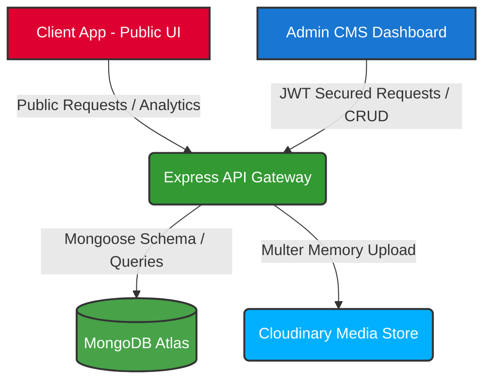

# 🚀 Modern Full-Stack Developer Portfolio & CMS

[](https://angular.dev)
[](https://nodejs.org)
[](https://mongodb.com)
[](https://tailwindcss.com)
[](https://greensock.com)
[](https://jwt.io)
[](https://swagger.io)
[](LICENSE)

A production-grade, highly-animated, dark-themed developer portfolio and custom Content Management System (CMS). Built with a modern **Monorepo Architecture**, it empowers developers to showcase their work, write blogs, and manage all portfolio elements in real-time through a protected dashboard.

This project is open-source and maintained by **[developerPapai](https://github.com/developerPapai)**.

---

## 📖 Table of Contents
1. [✨ Key Features](#-key-features)
2. [🏗️ System Architecture](#️-system-architecture)
3. [📁 Folder Structure](#-folder-structure)
4. [🛠️ Tech Stack](#️-tech-stack)
5. [🔌 API Endpoints Reference](#-api-endpoints-reference)
6. [⚙️ Environment Configuration](#️-environment-configuration)
7. [🚀 Quick Start Guide](#-quick-start-guide)
8. [📊 Custom Built-in Visitor Analytics](#-custom-built-in-visitor-analytics)
9. [🎨 Premium GSAP & UI Animations](#-premium-gsap--ui-animations)
10. [🌐 Deployment Strategy](#-deployment-strategy)
11. [📄 License](#-license)

---

## ✨ Key Features

### 💻 Client Application (Public Portfolio)
*   **Dynamic Landing Page**: Showcases rich developer profile information, skills, and featured projects dynamically loaded from the database.
*   **Aesthetic UI/UX**: Ultra-premium dark glassmorphism design using curated color palettes, elegant gradients, and interactive layouts.
*   **High-Performance Animations**: Powered by **GSAP (GreenSock)** for fluid, scroll-triggered card reveals, smooth glow maps, and a dynamic coder-typewriter widget.
*   **Angular SSR (Server-Side Rendering)**: Boosts SEO and page load speeds using Angular hydration. Safe platform checks (`isPlatformBrowser`) prevent server-side failures on window/document accesses.
*   **Interactive Contact Form**: Client-side validated form utilizing Angular `ReactiveFormsModule` with server-side rate-limiting to prevent spam.

### 🛡️ Admin CMS Panel
*   **Secure Authentication**: JWT-secured sessions with route-level protection via Angular `canActivate` `authGuard`.
*   **Automatic Session Interceptor**: Seamlessly injects `Bearer <token>` headers into every outgoing request and auto-redirects to `/login` upon session expiration (`401 Unauthorized`).
*   **Profile Editor**: Instantly modify your name, title, bio, location, contact, years of experience, availability status, and add multiple hero taglines.
*   **Skill Management**: Categorize skills (Frontend, Backend, Database, Tools) and update proficiency bars with ease.
*   **Project Control Board**: Perform full CRUD operations on projects, order them dynamically, configure tags, visibility states, and attach live/code URLs.
*   **Message Inbox**: Read, delete, and filter incoming queries with unread status counts.
*   **Visitor Dashboard**: Visualize real-time visitor stats, session activity, page path tracking, and interaction charts.

### ⚙️ RESTful API Engine
*   **Robust Backend**: Node.js + Express with an object-oriented Mongoose layer for MongoDB Atlas.
*   **Advanced Middleware & Security**: Protected by `helmet` headers, CORS restrictions, Gzip compression, rate-limiting, and global express error handling.
*   **Swagger API Docs**: Generates interactive Swagger OpenAPI 3.0 specs at `/api-docs` styled with a dark theme matching the app aesthetic.
*   **Cloudinary Integrations**: Handles direct upload of images and PDF resume documents via secure memory buffers using standard multipart/form-data.

---

## 🏗️ System Architecture



---

## 📁 Folder Structure

The monorepo separates concerns into clean workspace directories:

```
portfolio-root/
├── client/                 # Angular 18 Client Application (SSR Enabled)
│   ├── src/
│   │   ├── app/
│   │   │   ├── core/       # Services (Analytics, API, Profile, Projects), Interceptors, Guards
│   │   │   ├── pages/      # Home, Projects grid pages
│   │   │   └── shared/     # Navbar, Footer, Project-card components
│   │   └── environments/   # Environment config (dev/prod)
│   ├── package.json
│   └── tailwind.config.js
│
├── admin/                  # Angular 18 Admin CMS Dashboard
│   ├── src/
│   │   ├── app/
│   │   │   ├── core/       # Guards, HTTP Interceptor, Services (CRUD & Analytics)
│   │   │   └── pages/      # Dashboard, Projects CMS, Skills CMS, Profile Edit, Message Inbox
│   │   └── environments/   # Environment config (dev/prod)
│   ├── package.json
│   └── tailwind.config.js
│
└── backend/                # Node.js + Express REST API
    ├── src/
    │   ├── config/         # MongoDB setup, Cloudinary, Swagger options
    │   ├── controllers/    # Request handlers (Projects, Skills, Auth, Messages, Upload, Analytics)
    │   ├── middleware/     # JWT Auth verification, rate-limiter, CORS, errors
    │   ├── models/         # Mongoose Schemas (User, Project, Skill, Message, Visitor, Profile)
    │   ├── routes/         # Express endpoint definitions
    │   └── utils/          # DB seeding scripts
    ├── server.js           # Server initialization and middleware pipeline
    └── package.json
```

---

## 🛠️ Tech Stack

*   **Frontend Technologies**: Angular (v18.x), Tailwind CSS (v3.x), RxJS (v7.8), TypeScript.
*   **Animation Utilities**: GSAP (GreenSock v3.15) with ScrollTrigger plugins.
*   **Server Engine**: Node.js (v20+ LTS), Express.js (v4.x).
*   **Database Management**: MongoDB Atlas, Mongoose ODM.
*   **Session Security**: JSON Web Tokens (JWT), BcryptJS.
*   **File uploads**: Cloudinary API, Multer (Memory Engine).
*   **Documentation**: Swagger UI Express, Swagger-JSDoc.
*   **Host Environments**: Vercel (Frontends & SSR), Render / Railway (Backend).

---

## 🔌 API Endpoints Reference

### 🔐 Authentication Module
| HTTP Method | Path | Description | Access Level | Request Body / Params |
| :--- | :--- | :--- | :--- | :--- |
| **POST** | `/api/auth/seed` | Create initial Admin account | **Public (Disabled after first use)** | `{ email, password }` |
| **POST** | `/api/auth/login` | Secure administrator authentication | **Public** | `{ email, password }` |
| **GET** | `/api/auth/me` | Retrieve authenticated user profile | **Admin Only (Token Required)** | *None* |
| **PUT** | `/api/auth/change-password` | Change administrator password | **Admin Only (Token Required)** | `{ currentPassword, newPassword }` |

### 📁 Projects Module
| HTTP Method | Path | Description | Access Level | Request Body / Params |
| :--- | :--- | :--- | :--- | :--- |
| **GET** | `/api/projects` | Fetch visible projects (optional: `?featured=true`, `?category=<cat>`) | **Public** | *Query parameters* |
| **GET** | `/api/projects/all` | Fetch all projects including hidden ones | **Admin Only (Token Required)** | *None* |
| **GET** | `/api/projects/:id` | Fetch specific project details | **Public** | `id` (Param) |
| **POST** | `/api/projects` | Add a new project | **Admin Only (Token Required)** | Project payload |
| **PUT** | `/api/projects/:id` | Modify project fields | **Admin Only (Token Required)** | `id` (Param) + Payload |
| **PATCH** | `/api/projects/:id/toggle` | Toggle project visibility on/off | **Admin Only (Token Required)** | `id` (Param) |
| **DELETE** | `/api/projects/:id` | Delete project and remove assets from Cloudinary | **Admin Only (Token Required)** | `id` (Param) |

### 🧠 Skills Module
| HTTP Method | Path | Description | Access Level | Request Body / Params |
| :--- | :--- | :--- | :--- | :--- |
| **GET** | `/api/skills` | Fetch visible skills grouped by category | **Public** | *None* |
| **GET** | `/api/skills/all` | Fetch all skills (admin list) | **Admin Only (Token Required)** | *None* |
| **POST** | `/api/skills` | Add new skill | **Admin Only (Token Required)** | Skill payload |
| **PUT** | `/api/skills/:id` | Update skill levels | **Admin Only (Token Required)** | `id` (Param) + Payload |
| **DELETE** | `/api/skills/:id` | Remove a skill | **Admin Only (Token Required)** | `id` (Param) |

### 👤 Profile Module
| HTTP Method | Path | Description | Access Level | Request Body / Params |
| :--- | :--- | :--- | :--- | :--- |
| **GET** | `/api/profile` | Retrieve developer profile data | **Public** | *None* |
| **PUT** | `/api/profile` | Update profile information | **Admin Only (Token Required)** | Profile payload |

### 📬 Messages Module
| HTTP Method | Path | Description | Access Level | Request Body / Params |
| :--- | :--- | :--- | :--- | :--- |
| **POST** | `/api/messages` | Send an inquiry via public form (Rate-limited: 2/hr) | **Public** | `{ name, email, subject, message }` |
| **GET** | `/api/messages` | Retrieve inbox messages (Filter: `?read=true/false`) | **Admin Only (Token Required)** | *Query parameters* |
| **PATCH** | `/api/messages/:id/read` | Mark a message as read/unread | **Admin Only (Token Required)** | `id` (Param) + `{ read: boolean }` |
| **DELETE** | `/api/messages/:id` | Remove an inbox entry | **Admin Only (Token Required)** | `id` (Param) |

### 📊 Analytics Module
| HTTP Method | Path | Description | Access Level | Request Body / Params |
| :--- | :--- | :--- | :--- | :--- |
| **POST** | `/api/analytics/visit` | Register page view / init session | **Public** | `{ sessionId, path }` |
| **POST** | `/api/analytics/click` | Register button/link click event | **Public** | `{ sessionId, clickData }` |
| **GET** | `/api/analytics/stats` | Compile and retrieve dashboard metrics | **Admin Only (Token Required)** | *None* |

### 📤 Uploads Module
| HTTP Method | Path | Description | Access Level | Request Body / Params |
| :--- | :--- | :--- | :--- | :--- |
| **POST** | `/api/upload` | Upload images or PDF files to Cloudinary | **Admin Only (Token Required)** | Multipart file under name `file` |

---

## ⚙️ Environment Configuration

### Backend Setup (`backend/.env`)
Create a `.env` file in the `backend/` directory by copying `.env.example` and filling in the credentials:
```env
PORT=5000
NODE_ENV=development

# Database
MONGODB_URI=your_mongodb_atlas_uri

# JWT Configuration
JWT_SECRET=generate_a_secure_jwt_secret_key
JWT_EXPIRES_IN=7d

# Cloudinary Storage
CLOUDINARY_CLOUD_NAME=your_cloudinary_cloud_name
CLOUDINARY_API_KEY=your_cloudinary_api_key
CLOUDINARY_API_SECRET=your_cloudinary_api_secret

# Allowed CORS Origins
CLIENT_URL=http://localhost:4200
ADMIN_URL=http://localhost:4300
```

### Client Frontend (`client/src/environments/`)
*   **Development (`environment.ts`)**:
    ```typescript
    export const environment = {
      production: false,
      apiUrl: 'http://localhost:5000/api',
    };
    ```
*   **Production (`environment.prod.ts`)**:
    ```typescript
    export const environment = {
      production: true,
      apiUrl: 'https://your-backend-api.com/api',
    };
    ```

### Admin Frontend (`admin/src/environments/`)
Same layout as client environments — map `apiUrl` to your local backend server (`http://localhost:5000/api` for development) or your deployed production server.

---

## 🚀 Quick Start Guide

Follow these steps to run the complete full-stack portfolio locally.

### 📋 Prerequisites
Ensure you have the following installed on your machine:
*   [Node.js](https://nodejs.org) (v20.0.0 or later)
*   [MongoDB](https://www.mongodb.com/try/download/community) locally OR a MongoDB Atlas connection string

---

### Step 1: Run the Backend API
1. Open a terminal and navigate to the backend directory:
   ```bash
   cd backend
   ```
2. Install npm dependencies:
   ```bash
   npm install
   ```
3. Seed the Database:
   This utility creates the schema collections and inserts initial mockup profile info, demo projects, skills categorizations, and sets up a default admin credential:
   ```bash
   npm run seed
   ```
   > [!IMPORTANT]  
   > **Default Seed Credentials**  
   > *   **Admin Email**: `admin@papai.dev`  
   > *   **Admin Password**: `Admin@1234`  
   >  
   > Please login immediately upon launch and change your password for security.

4. Start the backend development server (with nodemon):
   ```bash
   npm run dev
   ```
   The backend service starts at `http://localhost:5000`. Explore the Swagger API documentation directly at `http://localhost:5000/api-docs`.

---

### Step 2: Run the Public Client
1. Open a second terminal window and navigate to the client folder:
   ```bash
   cd client
   ```
2. Install dependencies:
   ```bash
   npm install
   ```
3. Start the Angular Dev Server:
   ```bash
   npm start
   ```
   Open your browser to `http://localhost:4200` to view the beautiful public portfolio!

---

### Step 3: Run the Admin CMS Dashboard
1. Open a third terminal window and navigate to the admin folder:
   ```bash
   cd admin
   ```
2. Install dependencies:
   ```bash
   npm install
   ```
3. Start the Admin Server on a custom port to avoid conflict with the public client:
   ```bash
   npm start -- --port 4300
   ```
   Navigate to `http://localhost:4300` and login using the credentials seeded in Step 1.

---

## 📊 Custom Built-in Visitor Analytics

Unlike basic static portfolios, this application is equipped with a **real-time visitor monitoring system** designed to track user paths and engagements without third-party tracking scripts:

1.  **Session Tracking**: The `AnalyticsService` checks `localStorage` for a session token. If missing, it generates a cryptographically random session identifier.
2.  **Navigation Observer**: Listens to Angular's `NavigationEnd` events and registers user navigation logs directly onto `/api/analytics/visit` containing the page view path.
3.  **Engagement Tracking**: Captures mouse click coordinates and records clicks on key interactive elements such as anchor links `<a>`, buttons `<button>`, or cards containing internal elements.
4.  **Admin Visualization**: Compiles and showcases stats such as:
    *   Total page views count vs. unique sessions count.
    *   Top-performing pages list sorted by views.
    *   Device breakdown metrics (mobile vs. tablet vs. desktop) based on processed user agents.
    *   Browser analytics charts (Chrome, Safari, Firefox, Edge, etc.).

---

## 🎨 Premium GSAP & UI Animations

This portfolio is packed with rich micro-animations that deliver high visual quality:

*   **Custom Grid Glow Tracker**: Listens to desktop cursor positioning and updates CSS properties utilizing smooth GSAP interpolation, creating a vibrant mouse glow grid background.
*   **Staggered Fades**: Projects, skills, and timeline cards glide upwards with standard GSAP easing as they cross the viewport threshold (powered by GreenSock's scroll-triggering batch logic).
*   **Typewriter Synthesizers**: Programmatic typewriter widgets that cycles through custom developer slogans and actual Angular standalone component syntax chunks with random keystroke latency.
*   **Safe SSR Integration**: Angular 18's hydration engine compiles code serverside first. The animations are safely wrapped inside checks like `isPlatformBrowser(this.platformId)` and inside `ngAfterViewInit()` hooks to ensure correct execution.

---

## 🌐 Deployment Strategy

### ⚡ Frontend & SSR Deployment (Client & Admin)
*   Deploy both Angular apps to **Vercel** for fast edge delivery.
*   The Vercel-ready `vercel.json` configurations are fully integrated.
*   Ensure environment variables (`apiUrl` and `production`) are properly configured inside `src/environments/environment.prod.ts` prior to pipeline building.

### 🔌 Database & Backend Deployment
*   Host the backend on **Render**, **Railway**, or a standard VPS.
*   Configure the database on a free-tier Mongoose **MongoDB Atlas** cluster.
*   Add configuration environments securely inside the host dashboard (CORS URLs, Port, JWT keys, and Cloudinary keys).

---

## 📄 License

Distributed under the MIT License. See [LICENSE](LICENSE) for more details.

---

<p align="center">Made with ❤️ by <a href="https://github.com/developerPapai">developerPapai</a></p>
